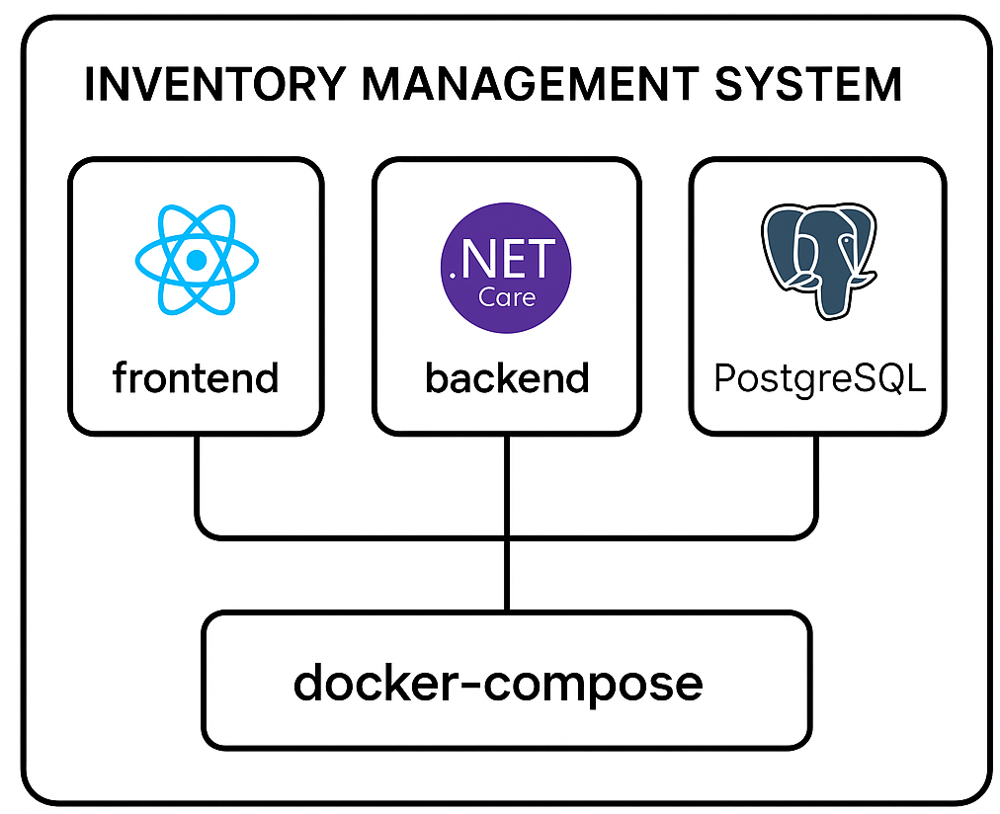

# Inventory Management System

A full-stack application for managing inventory with a React frontend and .NET Core backend.

## Project Structure

- `frontend/` - React TypeScript application
- `backend/` - .NET Core 8 Minimal API
- `docker-compose.yml` - Docker configuration for all services



## Prerequisites

- Docker and Docker Compose
- .NET Core SDK 8.0
- Node.js (for local development)
- Yarn package manager

## Getting Started

1. Clone the repository
2. Run the application using Docker:

```bash
docker-compose up --build
```

The application will be available at:
- Frontend: http://localhost:3000
- Backend API: http://localhost:5000
- PostgreSQL: localhost:5432

## API
To view and test all available endpoints please access:
- http://localhost:5000/swagger

### Frontend

```bash
cd frontend
yarn install    # Install dependencies
yarn start      # Start development server
```

For other common frontend commands:
```bash
yarn build        # Create production build
yarn test         # Run unit tests
yarn e2e          # Run E2E automated tests with Cypress
yarn cypress open # Open Cypress UI to run the tests
```

### Backend

```bash
cd backend
dotnet restore
dotnet run
```

### Backend Tests

```bash
cd backend
# Run tests
dotnet test

# Generate coverage report
./generate-coverage.ps1
```

The coverage report will be generated in HTML format and automatically opened in your default browser. You can find the report at:
```
backend/InventoryApp.Tests/TestResults/CoverageReport/index.html
```

Key test features:
- xUnit test framework
- Entity Framework in-memory database for integration tests
- Moq for mocking dependencies
- Coverlet for code coverage analysis
- ReportGenerator for HTML coverage reports
- Coverage configuration excludes database migrations

## End-to-End (E2E) Tests

End-to-End (E2E) tests are designed to test the complete functionality of the application by simulating real user scenarios. These tests ensure that all components of the system work together as expected.

I decided to use Cypress to create a small automated E2E test covering the main features:
- List Produts
- Edit an Existing Product
- Add a new product

### E2E execution Prerequisites
On the frontend folder (/frontend)
- Ensure all dependencies are installed by running:
  ```bash
  yarn install
- The application must be running (frontend and backend)
- Under the frontend directory run: 
```bash
yarn run e2e
```

If you want to see Cypress UI with the automation tests run:
```bash
yarn cypress open
```
Select E2E tests, choose your browser and Start the E2E tests selecting "ProductListPage" spec.


## Features

- Product listing with details view
- CRUD operations for products
- Inventory management
- RESTful API
- Swagger documentation
- PostgreSQL database

## API Endpoints
I decided to separate the API in two controllers so we can have a better
code organization.

### Products
- `GET /api/products` - Get all products
- `GET /api/products/{id}` - Get product by ID
- `POST /api/products` - Create new product
- `PUT /api/products/{id}` - Update product
- `DELETE /api/products/{id}` - Delete product

### Inventory
- `GET /api/inventory/products/{productId}` - Get product stock information
- `POST /api/inventory/products/{productId}/stock` - Add stock to product
- `DELETE /api/inventory/products/{productId}/stock` - Remove stock from product

## Technologies

- Frontend:
  - React 19
  - TypeScript
  - Material UI components
  - Yarn (package manager)
  
- Backend:
  - .NET Core 8
  - Entity Framework Core
  - PostgreSQL
  - Swagger/OpenAPI

- Infrastructure:
  - Docker
  - Docker Compose

## Main Design Decisions

- Decided to split Products and Inventory controll logic.
  This brings more control and separion of concerts, less code in single controller and service. Better code readability and future scalability.

- Created a DTO layer to separate the concerns add security (expose only what is needed).

- Decided to build the frontend exercise as an extension of the API exercise
  That way I could show more control of how to setup a project using a modern architecture with docker.

- Decided to implement E2E tests that can automatize QA tests of the entire application that integrate Backend, Frontend and Database.

## If we have more time, next steps:

### Backend (.NET):
API Key Validation:

Generate an API key and require it to be sent in the headers of every request.
Validate the API key on the backend.

HTTPS:
Enforce HTTPS to encrypt communication between the frontend and backend.

Rate Limiting:
Implement rate limiting to prevent abuse of the API.

IP Whitelisting:
Restrict access to the API by allowing only requests from the IP address of your frontend server.

## Frontend:
Use Environment Variables:
Store sensitive information like API keys in environment variables, not in the codebase.

Obfuscate API Calls:
Use a proxy server to hide direct API calls from the frontend.

CSRF Protection:
Implement CSRF tokens to prevent cross-site request forgery attacks.

Validate Input:
Sanitize and validate all user inputs before sending them to the backend.

## Deployment

Implement CI/CD pipelines using Github actions to deploy it to any desired place:
- Azure
- AWS
- GCP 
- Any other cloud/host service.